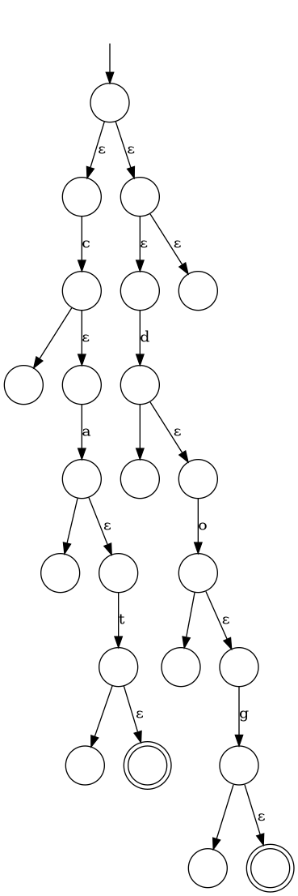

# Reg Viz

This is a little haskell program that takes descriptions of regular expressions,
and outputs graphs of an NFA recognizing them, in a syntax suitable for consumption
through something like [graphviz](https://graphviz.org/).

Right now, it's not optimized to produce short NFAs, just the minimal NFA that does the
job. In the future, you could look at optimizing these graphs to produce the most concise
versions possible, but that's hardly necessary for now.

## Usage

The program takes a single argument, the regular expression, and then outputs the graph
to standard out.

So:

```
reg-viz 'cat|dog' > catdog.dot
dot -Tpng catdog.dot -o catdog.png
```

would end up producing the following:



Of course, you'll need to have installed graphviz and what not beforehand.
